# :one: Лабораторная работа №1

> **Тема**: *Создание и развертывание статического сайта на базе MkDocs с публикацией на GitHub Pages*   
> **Дедлайн**: 14.03.2026  
> **Статус**: :material-clock: В процессе...

---

## 🎯 Цель работы

-   Освоить процесс создания статического сайта с использованием генератора документации **MkDocs**.
-   Научиться организовывать структуру документации проекта (портфолио лабораторных работ).
-   Изучить базовые принципы работы с системой контроля версий **Git** и платформой **GitHub**.
-   Развернуть статический сайт с использованием механизма GitHub Pages на домене вида `username.github.io`.
-   Освоить базовую настройку темы оформления и конфигурационного файла `mkdocs.yml`.

## 📝 Задание

!!! example "ТЗ"
    ## **Основная часть:**
    1.  Создать публичный репозиторий на GitHub для размещения сайта-портфолио.
    2.  Настроить GitHub Pages так, чтобы публикация осуществлялась из каталога `/docs` ветки `main`.
    3.  Клонировать репозиторий на локальный компьютер.
    4.  Создать и активировать виртуальное окружение Python.
    5.  Установить MkDocs в виртуальное окружение.
    6.  Настроить файл `.gitignore` (исключить виртуальное окружение, служебные файлы и др.).
    7.  Создать новый сайт командой:  
    `mkdocs new source`
    8.  Перейти в каталог source и запустить локальный сервер:  
    `cd source && mkdocs serve`
    9. Выполнить сборку сайта в каталог `/docs` корня репозитория:  
    `mkdocs build -d ../docs`
    10. Выполнить коммит и отправку в удалённый репозиторий (включая каталог `source` и каталог `docs`).
    ---
    ## **Самостоятельная часть:**
    1. Выбрать и подключить тему оформления (например, `dracula`, `material` или иную тему, подходящую для портфолио).
    2.  Настроить файл `mkdocs.yml`:  
        - указать название сайта;  
        - задать тему;  
        - реализовать структуру меню через параметр `nav`.
    3. Создать структуру страниц:  
        - Главная страница;  
        - Страница «Об авторе»;  
        - Раздел «Лабораторные работы»:  
            - отдельная страница для каждой лабораторной работы курса;
            - единый шаблон структуры отчёта (цель, задание, код, выводы).
    4. Обеспечить корректную навигацию по сайту.
    5. Выполнить повторную сборку и публикацию сайта.
---
!!! note "Требования к выполнению"

    - Репозиторий должен быть публичным. ✅
    - Сайт должен быть доступен по адресу вида: https://username.github.io/ ✅
    - Структура меню должна быть логичной и иерархической. ✅
    - Должно быть создано не менее 5 страниц. ✅
    - Тема оформления должна быть выбрана осознанно (обоснование выбора — кратко в README).
    - Все изменения должны быть зафиксированы в истории коммитов (минимум 5 осмысленных коммитов). ✅
---

> ## **Выполнение заданий**:

## 1.1) **Публичный репозиторий** 
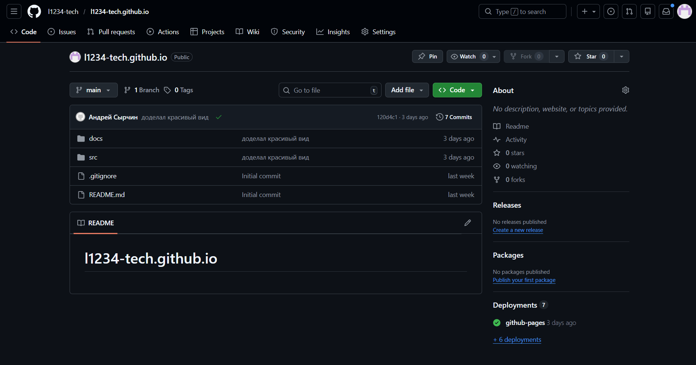
---
## 2.1)  **Настройка `Pages`**
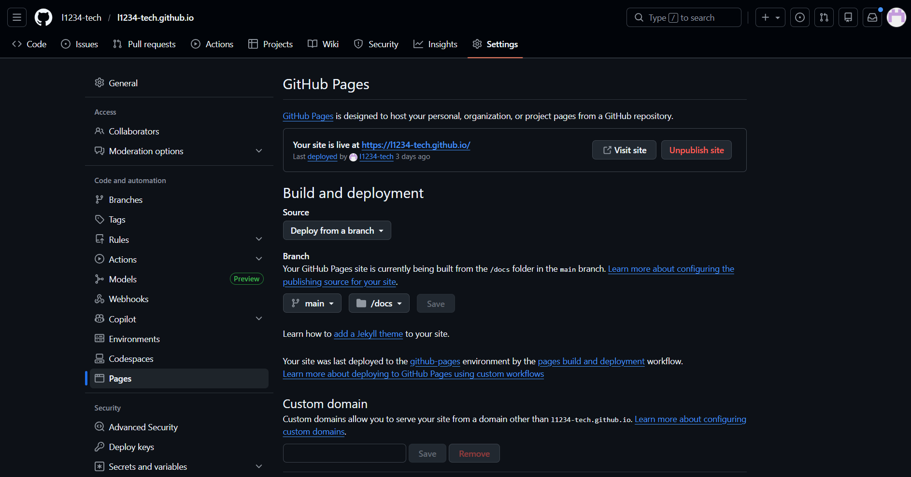
---
## 3.1) **Клонирование репозитория**  
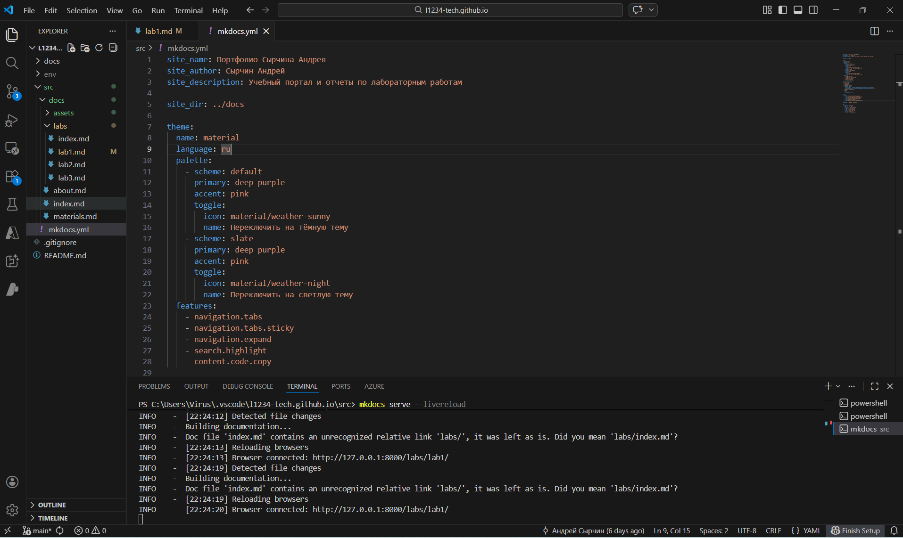
---
## 4.1) **Виртуальное окружение**  
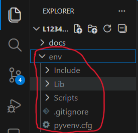
---
## 5.1) **Установка `Mkdocs`**  
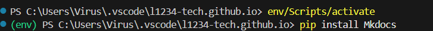
---
## 6.1) **`.gitignore`**
venv/  
.venv/  
env/  
ENV/  
env.bak/  
venv.bak/  
.pytest_cache/  
.coverage  
htmlcov/  

__pycache__/  
*.py[cod]  
*$py.class  
*.so  
.Python  
build/  
develop-eggs/  
dist/  
downloads/  
eggs/  
.eggs/  
lib/  
lib64/  
parts/  
sdist/  
var/  
wheels/  
*.egg-info/  
.installed.cfg  
*.egg  

.env  
.env.local  
.env.*.local  
*.env  
secrets/  
credentials/  
*.pem  
*.key  

*.log  
logs/  
tmp/  
temp/  
*.tmp  
*.temp
---
## 7.1) **Новый сайт**  
``>> mkdocs new source``  
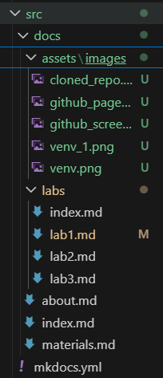
---
## 8.1) **Локальный сервер**
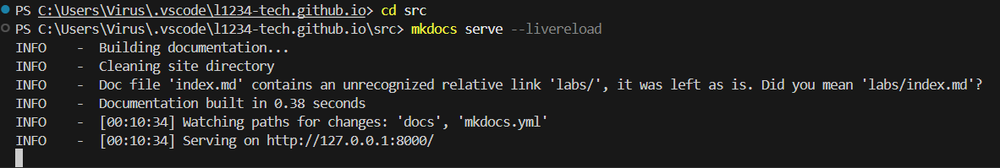
---
## 9.1) **Сборка сайта**
``>> mkdocs build -d ../docs``  
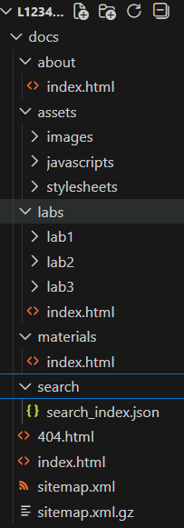
## 10.1) **Коммиты** 
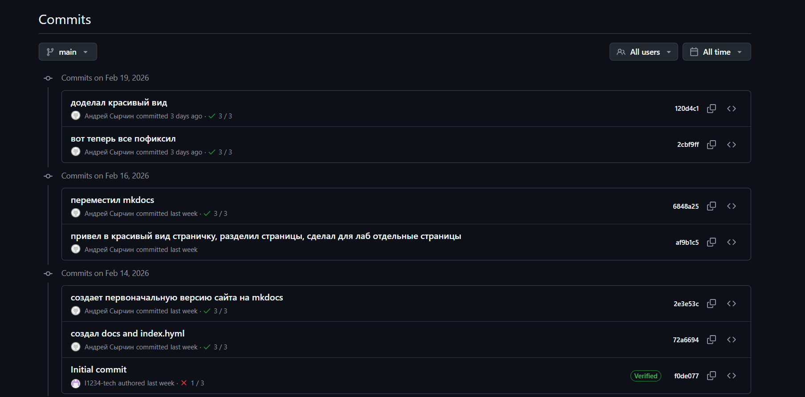  
---
## 1.2) **Тема оформления** 
``>> pip install mkdocs-material``  
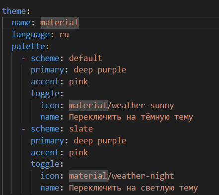  
## 2.2) **Настройка файл ``mkdocs.yml``** 
    ```yaml
    site_name: Портфолио Сырчина Андрея
    site_author: Сырчин Андрей
    site_description: Учебный портал и отчеты по лабораторным работам

    site_dir: ../docs

    theme:
    name: material
    language: ru
    palette:
        - scheme: default
        primary: deep purple
        accent: pink
        toggle:
            icon: material/weather-sunny
            name: Переключить на тёмную тему
        - scheme: slate
        primary: deep purple
        accent: pink
        toggle:
            icon: material/weather-night
            name: Переключить на светлую тему
    features:
        - navigation.tabs
        - navigation.tabs.sticky
        - navigation.expand
        - search.highlight
        - content.code.copy

    markdown_extensions:
    - attr_list
    - md_in_html
    - admonition
    - pymdownx.details
    - pymdownx.emoji:
        emoji_index: !!python/name:material.extensions.emoji.twemoji
        emoji_generator: !!python/name:material.extensions.emoji.to_svg
    - pymdownx.superfences
    - tables
    - toc:
        permalink: true

    extra:
    social:
        - icon: fontawesome/brands/github
        link: https://github.com/l1234-tech
        - icon: fontawesome/brands/telegram
        link: https://t.me/@dark_kurom1
        - icon: material/email
        link: mailto:syrchin.andrej@inbox.ru

    copyright: © 2026 Сырчин Андрей

    nav:
    - Главная: index.md
    - Лабораторные работы:
        - Главная: labs/index.md
        - Лаба 1: labs/lab1.md
        - Лаба 2: labs/lab2.md
        - Лаба 3: labs/lab3.md
    - Обо мне: about.md
    - Материалы: materials.md
    ```
---
## 3.2) **Создание структуры страниц**
``Видно из самого сайта``  
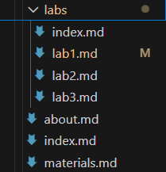  
---
## 4.2) **Навигация**
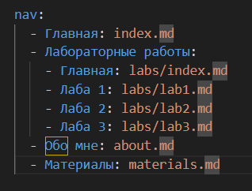  
---
## 5.2) **Повторая сборка и публикацая сайта**
``>> cd src``  
``>> mkdocs build``  
> Важно! Наличие ``site_dir: ../docs`` в **mcdocs.yml** 