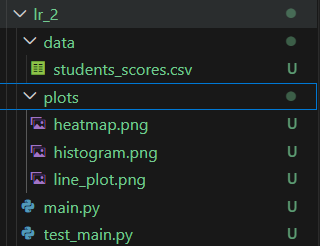
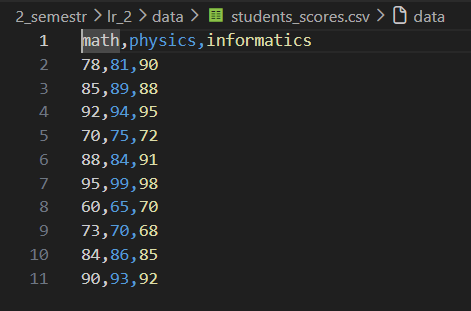
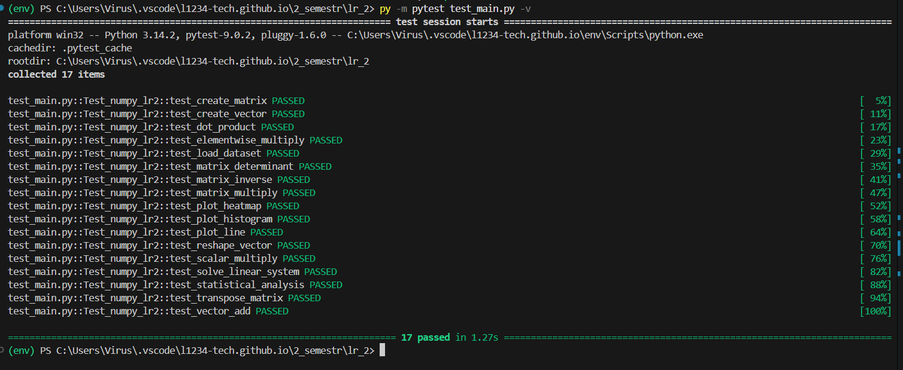
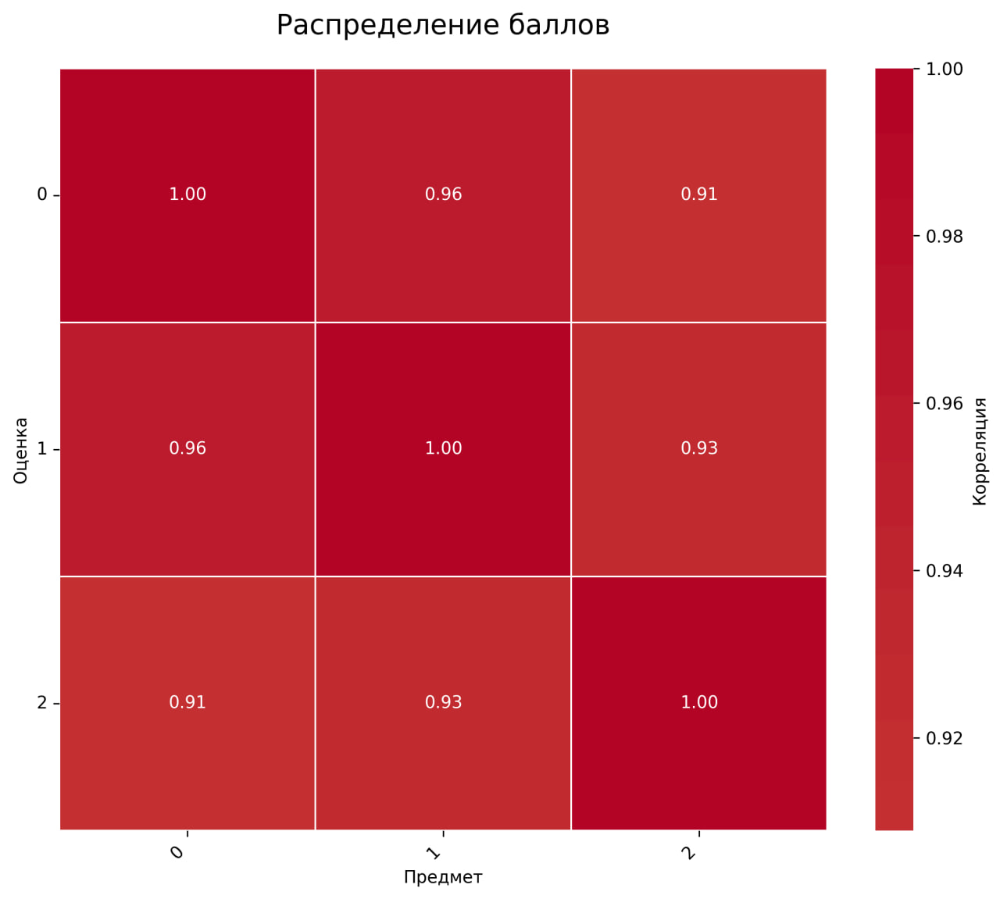
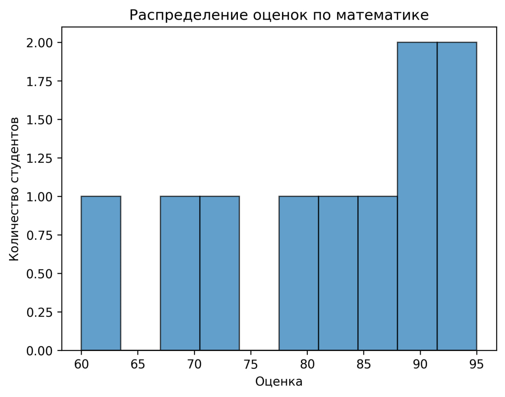
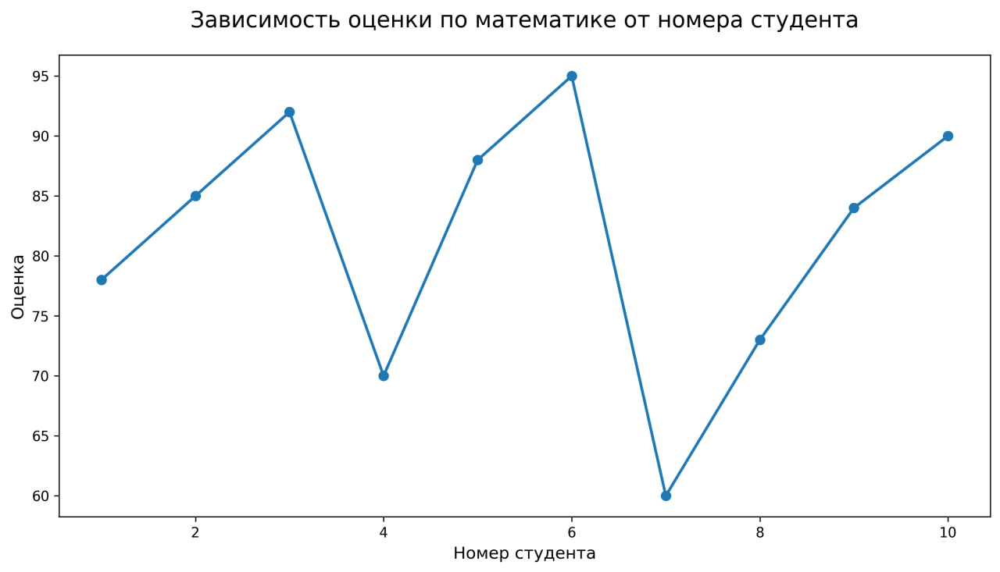

# :one: Лабораторная работа №2

> **Тема**: *Основы NumPy: массивы и векторные операции*   
> **Дедлайн**: 14.03.2026  
> **Статус**: :material-check-circle: Выполнена!

---

## 🎯 Цель работы

-   Освоить процесс создания статического сайта с использованием генератора документации **MkDocs**.
-   Научиться организовывать структуру документации проекта (портфолио лабораторных работ).
-   Изучить базовые принципы работы с системой контроля версий **Git** и платформой **GitHub**.
-   Развернуть статический сайт с использованием механизма GitHub Pages на домене вида `username.github.io`.
-   Освоить базовую настройку темы оформления и конфигурационного файла `mkdocs.yml`.

## 📝 Задание

!!! example "ТЗ"
    ## Основная часть
    *Реализовать все функции (из файла LR-2-main.py), чтобы проходили тесты*
---
!!! note "Требования к выполнению"

    - Формат отчета: описание задачи, как была решена, какие нюансы есть при решении. ✅
    - Ссылку на сформированный статический сайт с отчетом по выполнению заданий лабораторной работы ✅
    - Код функций должен проходить тесты, аннотирован, содержать докстринг, соблюдать PEP-8. ✅
---
## *Важное решение !!!*
``Теперь в репозитории с сайтом все материалы и лабораторные работы с 1 и 2 семестра.``

---

## **Выполнение заданий**:

## 1) **Перед началом:**
### 1. Создайте виртуальное окружение: ``python -m venv numpy_env``
- Выполнено в первой лабе :material-check-circle:

---
### 2. Активируйте виртуальное окружение:
1. Windows: numpy_env\Scripts\activate
2. Linux/Mac: source numpy_env/bin/activate
### Выполнено в первой лабе :material-check-circle:
---
   
### 3. Установите зависимости: ``pip install numpy matplotlib seaborn pandas pytest``
- Выполнено в первой лабе :material-check-circle:

--- 
## 2) **Структура проекта:**
lr_2/    
├── main.py     
├── test.py    
├── data/    
│   └── students_scores.csv    
└── plots/

### Выполнение: :material-check-circle:

---
## 3) **Структура проекта:**
- В папке data создайте файл students_scores.csv

### Выполнение: :material-check-circle:

---
## 4) **Проверка лабораторной работы (тесты):**
``python3 -m pytest test.py -v``
### Выполнение: :material-check-circle:

---

## 5) **Визуализация:**
### *Тепловая карта*

### *Гистограмма*

### *Линейный график*
