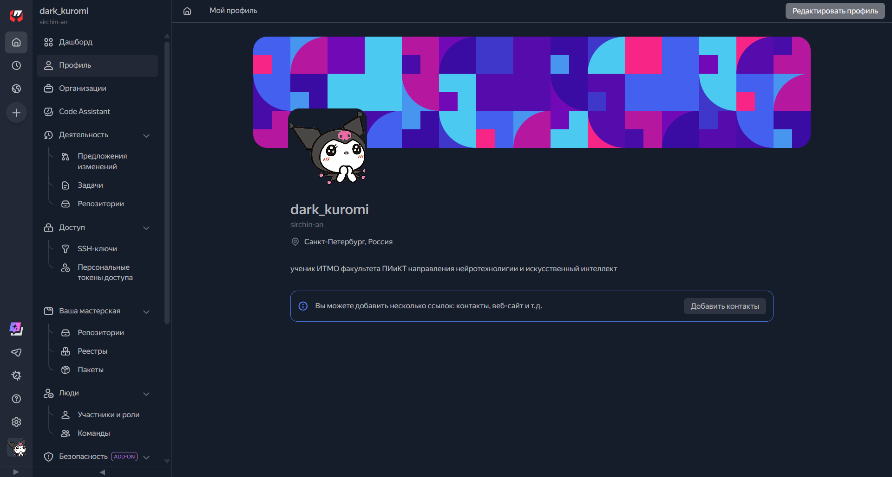
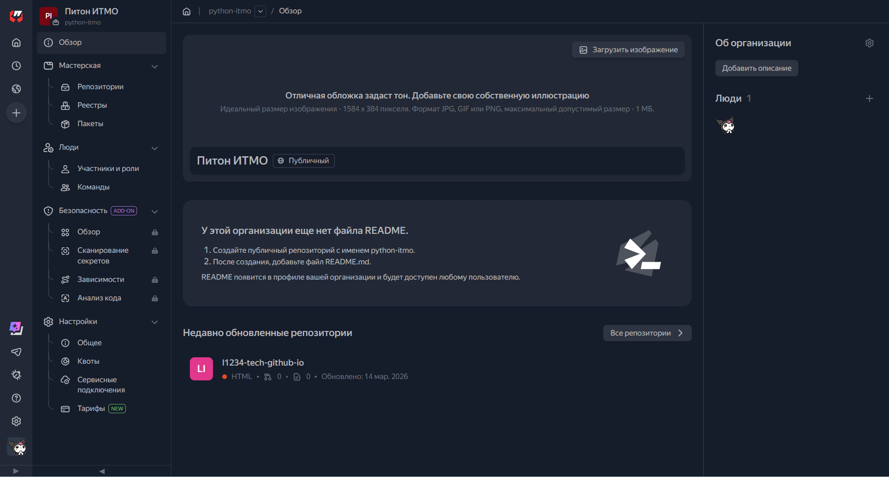
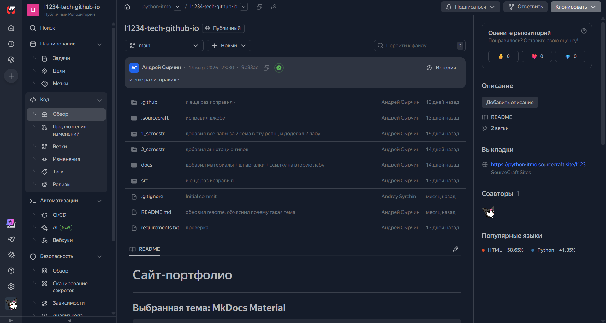
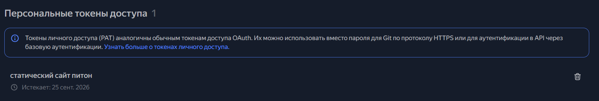
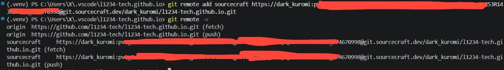

# :three: Лабораторная работа №3

> **Тема**: *CI/CD для статического сайта в SourceCraft*   
> **Дедлайн**: 28.03.2026  
> **Статус**: :material-check-circle: Выполнена!

---

## 🎯 Цель работы

-   Создание СI/CD для статического сайта в SourceCraft (предварительно склонировав репозиторий)

## 📝 Задание

!!! example "ТЗ"
    ## Основная часть
        1) Авторизуйтесь с использованием своего аккаунта в Яндекс на сайте sourcecraft.dev.

        2) Создайте публичную организацию.

        3) Создайте пустой репозиторий.

        4) Создайте токен для работы по HTTPS: https://sourcecraft.dev/portal/docs/ru/sourcecraft/security/pat 
        Токен необходимо записать куда-то, чтобы не забыть, поскольку посмотреть второй раз его не получится. 
        Токен должен быть с правами Maintainer. Лучше создавать токен по длительности на пол года / год.

        5) Откройте свой локальный репозиторий в IDE и добавьте дополнительный 
        удаленный репозиторий с помощью команды git remote add sourcecraft  
        https://<имя_аккаунта>:<персональный_токен>@git.sourcecraft.dev/<имя_аккаунта>/<имя_репозитория>.git

        6) Проверьте, что удаленный репозиторий, доступный по имени sourcecraft, 
        был добавлен в список удаленных репозиториев git remote -v. 
        У вас должен отображаться второй удаленный репозиторий sourcecraft.
---
!!! note "Требования к выполнению"

    - Формат отчета: описание задачи, как была решена, какие нюансы есть при решении. ✅
    - Ссылку на сформированный статический сайт с отчетом по выполнению заданий лабораторной работы ✅
---
## *[Сайт на Sourcecraft](https://sourcecraft.dev/python-itmo/l1234-tech-github-io)*

## **Выполнение заданий**:

## 1) **Авторизация на Sourcecraft**

---
## 2) **Создание публичной организации**

---
## 3) **Создание репозитория**

- **ПРИМЕЧИНИЕ: скриншот сделан после того, как весь репозиторий с гитхаба был запушен в пустой репозиторий на soutcecraft**

---
## 4) **Создание токена для работы по HTTPS**

---
## 5/6) **Создание токена для работы по HTTPS и проверка добавления**

---
