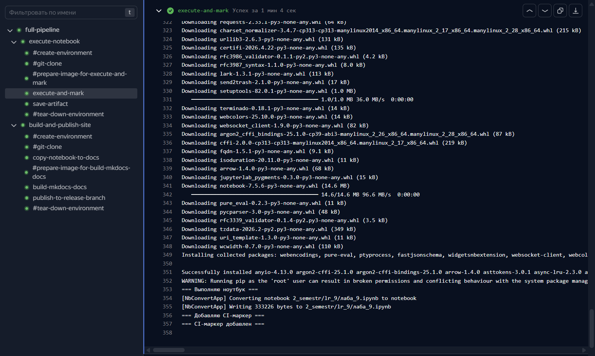
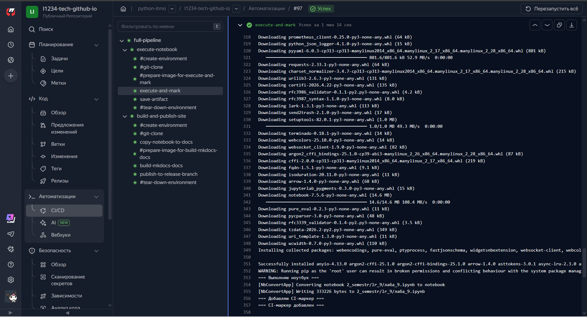
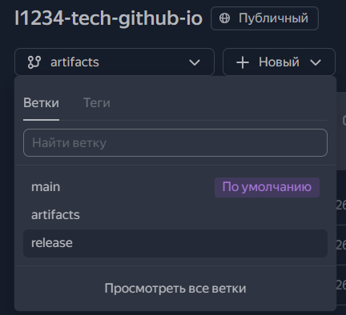
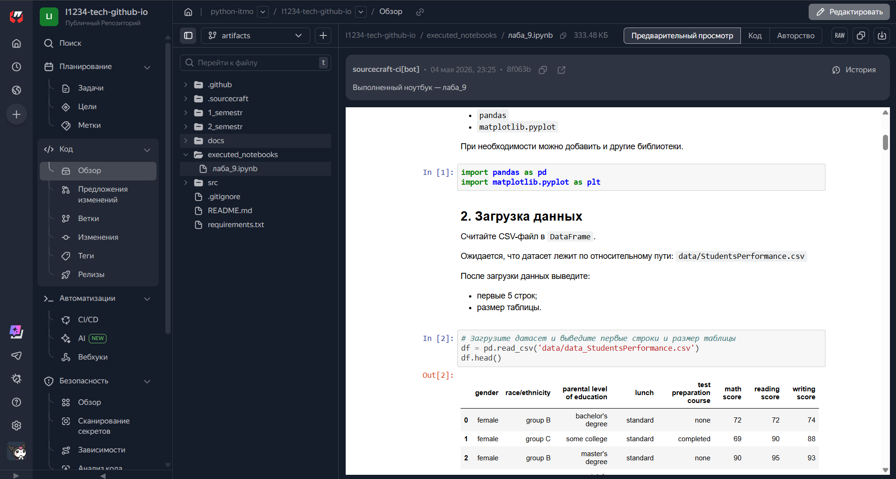

# :nine: Лабораторная работа №9

> **Тема**: *Работа с графикой. Sourcecraft. CI/CD. Артефакты*   
> **Дедлайн**: 09.05.2026  
> **Статус**: :material-check-circle: Выполнена!

---

## 📝 Задание

!!! example "ТЗ"
    1. Сделайте форк репозитория, получив собственный репозиторий на Sourcecraft . 
    2. Выполните задание, опубликованное в ipynb-файле, который размещен в репозитории
    3. Заполните пропуски в борде, дополнив кодом ячейки, где это необходимо. 
    4. Выполните самостоятельную работу, опубликованную в борде колаба.
    5.Дополните написанный вами CI для генерации артефактов сурскрафтом таким образом, чтобы раннер дописывал в первую или
    последнюю ячейку текст, свидетельствующий  выполнении (execute) кода именно раннером (указание каких-то идентификаторов того,
    что это выполнено не локально на вашей машине, и не в Google Colaboratory).
    6.Оставить ссылку на публичный репозиторий в качестве ответа. Ссылка должна быть ссылкой, т. е. кликабельна.

---

> ## **Выполнение заданий**:

---

## **[Сам борд 9 лабы](https://sourcecraft.dev/python-itmo/l1234-tech-github-io/browse/2_semestr/lr_9/%D0%BB%D0%B0%D0%B1%D0%B0_9.ipynb?rev=main)**

---

### 1-4) *Работа в борде выполнена успешно !!!*

---

### 5) *Артефакты*

- #### **Логи в ci/cd**:

- #### **Отдельная ветка, куда загружается последний выполненный борд (артефакт)**:

- #### **Как выглядит выполенный борд в этой ветке**:

---